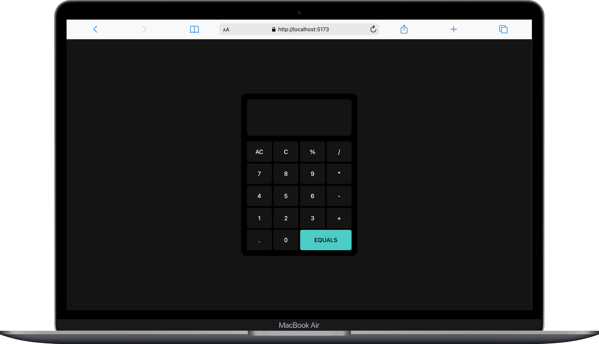
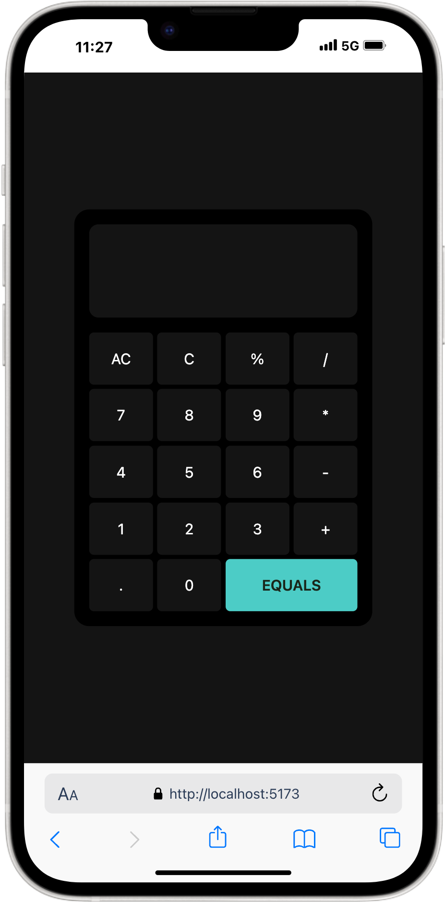

# 🧮 Calculator App

A simple calculator application built using **React**, **Tailwind CSS**, and **JavaScript**. This project demonstrates the creation of a functional and responsive calculator with a modern UI.

---

## ✨ Features

- ✅ **Basic Operations**: Perform addition, subtraction, multiplication, and division.
- ⚡ **Real-Time Calculation**: Display results instantly using `eval` for mathematical expressions.
- 🛡️ **Error Handling**: Handles invalid inputs gracefully by showing an error message.
- 📱 **Responsive Design**: Fully responsive UI powered by Tailwind CSS.
- 🔧 **Customizable Keys**: All calculator keys are dynamically rendered for easy customization.

---

## 🛠️ Tech Stack

1. ⚛️ **React**: Used to create dynamic and reusable components for the calculator.
2. 🟨 **JavaScript**: Manages core functionality, such as input validation and operations.
3. 🎨 **Tailwind CSS**: Provides a clean, responsive, and modern design.

---

## 🚀 Usage

1. Use the numeric and operator keys to input calculations.
2. Click the `EQUALS` button to see the result.
3. Use the `C` button to delete the last entry and `AC` to clear all inputs.

---

## 🌐 Demo

You can see the live version of the app here: [Calculator Demo](https://jc-quick-calc.netlify.app/)

---

## 📸 Screenshots

### 🖥️ Desktop View

### 📱 Mobile View

---

## 📜 License

This project is open-source and available under the [MIT License](LICENSE).

---

## 🙌 Acknowledgments

- 📘 [React Documentation](https://reactjs.org/docs/getting-started.html)
- 🎨 [Tailwind CSS Documentation](https://tailwindcss.com/docs)
- 📖 [JavaScript MDN Docs](https://developer.mozilla.org/en-US/docs/Web/JavaScript)
